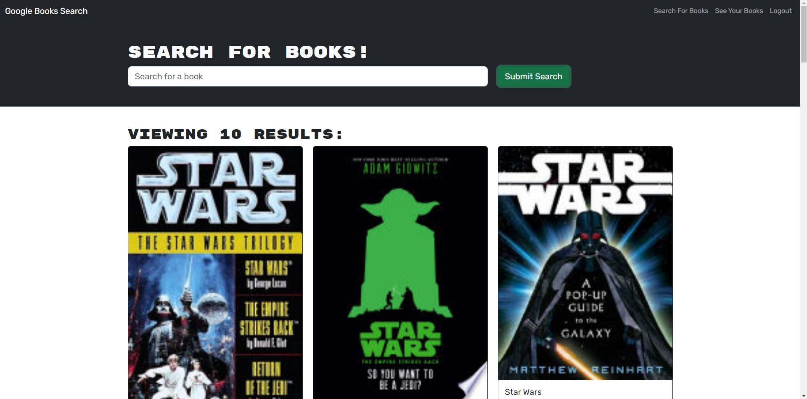
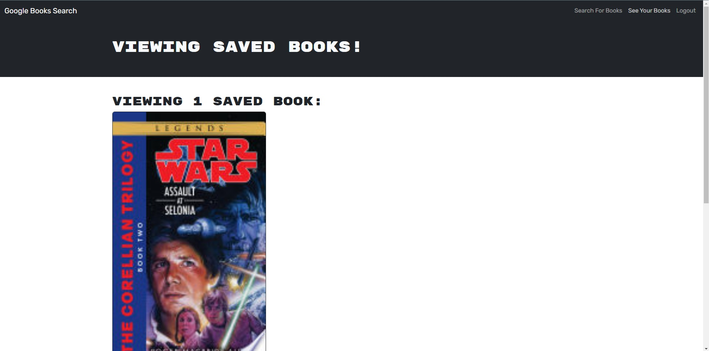

# Graph-Refactor
## Description

Refactoring of a website to use graphql instead of restful api

## Table of Contents
[Technology Used](#technology-used) 
[Usage](#usage) 
[Learning Points](#learning-points) 
[Credits](#credits) 
[Author](#author) 

## Technology Used
|Technology Name|Resource|
|-----------|------------|
|JavaScript|[Link](https://www.w3schools.com/js/js_intro.asp)|
|Git|[Link](https://www.w3schools.com/git/git_intro.asp?)|
|HTML|[Link](https://developer.mozilla.org/en-US/docs/Learn/Getting_started_with_the_web/HTML_basics)|
|CSS|[Link](https://developer.mozilla.org/en-US/docs/Web/CSS)|
|React|[Link](https://react.dev/)|
|GraphQL|[Link](https://www.apollographql.com/docs/)|
|Vite|[Link](https://vitejs.dev)|
|ESLint|[Link](https://eslint.org/)|

## Usage
Allows one to search for books using Google Books API  

   then save them once logged in

## Learning Points
Got a deeper undestanding of React and GraphQL, and how difficult refactoring can actually be

## Author
Alonso Ampuero  
[Twitter](https://www.twitter.com/fenri.ragni)  
[Github](https://www.github.com/fenri.ragni)  
[Portfolio](https://main--alonso-portfolio-react.netlify.app/)